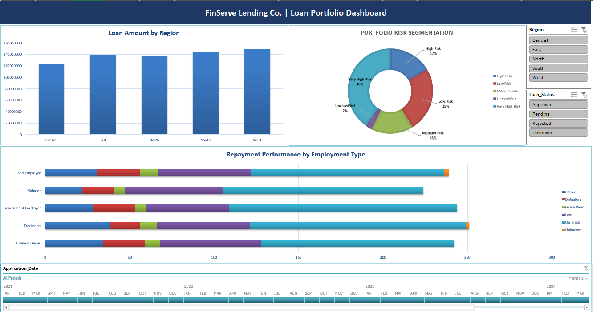

# FinServe Loan Portfolio Analysis

## Overview
This project analyzes the loan portfolio of FinServe Lending Co., a fictional multi-region lending company operating across India, as part of the Career 247 "Business Analytics with GenAI" case study. The goal was to turn a raw, inconsistent loan dataset into decision-ready insights through data cleaning, risk classification, portfolio analysis, and an interactive Excel dashboard.

## Business Problem
FinServe's management observed:
- Rising late repayments and loan defaults
- No centralized view of the loan portfolio
- Difficulty identifying high-risk borrowers
- Limited visibility into branch-level performance

The task was to clean the loan data, classify borrowers by risk, and build a dashboard that lets management monitor portfolio health at a glance.

## Dataset

| Metric | Value |
|---|---|
| Raw records | 1,215 |
| Records after removing duplicates | 1,200 |
| Regions | 5 (Central, East, North, South, West) |
| Branches | 25 |
| Loan purposes | 8 (Agriculture, Business Expansion, Debt Consolidation, Education, Home Purchase, Medical, Personal, Vehicle Loan) |
| Analysis tool | Microsoft Excel |

Key fields: Loan ID, Customer Name, Employment Type, Monthly Income, Loan Amount, Credit Score, Loan Status, Repayment Status, Region, Branch, Outstanding Balance.

## Tools & Techniques
- Excel Tables, PivotTables, PivotCharts
- Slicers and a Timeline filter for an interactive dashboard
- Conditional formatting (risk color-coding, data bars)
- Formulas: `TRIM`, `CLEAN`, `SUBSTITUTE`, `PROPER`, `IF`, `IFS`, `XLOOKUP`, `INDEX`/`MATCH`, `DATEDIF`, `EDATE`, `ROUND`

## Data Cleaning
The raw dataset had nine data-quality issues, each fixed and verified before analysis:
- Removed 15 duplicate Loan IDs
- Trimmed extra spaces from customer names
- Standardized inconsistent Employment Type casing
- Removed hidden non-breaking spaces from Loan Purpose
- Flagged 30 missing Credit Scores as "Not Available"
- Corrected 25 dates stored as DD/MM/YYYY instead of YYYY-MM-DD
- Standardized 25 branch names against a reference table (case, spacing, punctuation)
- Labeled blank Loan Status and Repayment Status values as "Unknown" so no loan is excluded from a pivot
- Converted the cleaned data into structured Excel Tables

## Feature Engineering

| Feature | Purpose |
|---|---|
| Days to Approval | Loan processing turnaround |
| Loan Age (Months) | Portfolio aging |
| Maturity Date / Is Matured | Loan lifecycle tracking |
| DTI Ratio / DTI Flag | Borrower affordability |
| Risk Category / Risk Code | Credit risk classification |
| Branch Manager | Branch-level lookup |

## Key Insights
- Portfolio size: 1,200 loans totaling ₹69.45 Cr sanctioned (₹51.9 Cr on an approved-only basis).
- 56.8% of loans (682) fall into the High or Very High Risk bands, yet approval rates barely differ by risk category (69.8%–73.6%), suggesting credit score isn't the main approval gate.
- West carries the highest outstanding balance (₹5.59 Cr), narrowly ahead of North (₹5.56 Cr).
- Business Owners have the most combined late and defaulted loans (85), while raw default counts are tied at 25 across three employment types.
- Kolkata-Salt Lake is the top branch by loan exposure (₹4.23 Cr).
- Application volume is stable, averaging about 33 applications a month from January 2021 to January 2024.

## Business Questions Answered
**Portfolio Exposure** — Total loan amount disbursed, average loan size by region, outstanding balance by region, highest-exposure region

**Risk Analysis** — Distribution of borrowers by risk category, identification of High-Risk and Very High-Risk customers, risk concentration by branch

**Repayment Performance** — Default and late-payment analysis, repayment behavior by employment type

**Branch Analysis** — Branch-wise loan exposure and high-risk concentration

**Trend Analysis** — Monthly application volume and approval trend

## Dashboard
The interactive dashboard includes:
- Loan Distribution by Region (clustered column chart)
- Portfolio Risk Segmentation (doughnut chart with percentage labels)
- Repayment Performance by Employment Type (stacked bar chart)
- Region and Loan Status slicers, connected to every chart
- An Application Date timeline for filtering by month

### Dashboard Preview


## Key Skills Demonstrated
Business Analytics, Data Cleaning & Validation, Risk Assessment, Pivot Table Analysis, Data Visualization, Dashboard Design, KPI Reporting, Decision Support Reporting

## Business Impact
This project shows how raw lending data can be turned into insights that help management:
- Monitor portfolio health at a glance
- Identify and act on high-risk borrowers
- Track repayment performance by segment and branch
- Support data-driven lending decisions

## Repository Structure
```
finserve-loan-portfolio-analysis/
├── README.md
├── LICENSE
├── FinServe_Loan_Portfolio_Analysis.xlsx
├── CaseStudy & Dataset/
│   └── FinServe_CaseStudy.pdf
└── Screenshots/
    ├── Dashboard.png
    ├── Risk_Distribution.png
    ├── Loan_Exposure.png
    └── Repayment_Performance.png
```

## Author
**Satyabrata Sahoo**
MBA – IT & Systems Management
Business Analytics | Data Analytics | Excel | SQL | Power BI | Python

[LinkedIn](https://www.linkedin.com/in/imsatya16/) · [GitHub](https://github.com/imsatya16)

## Project Status
Completed
